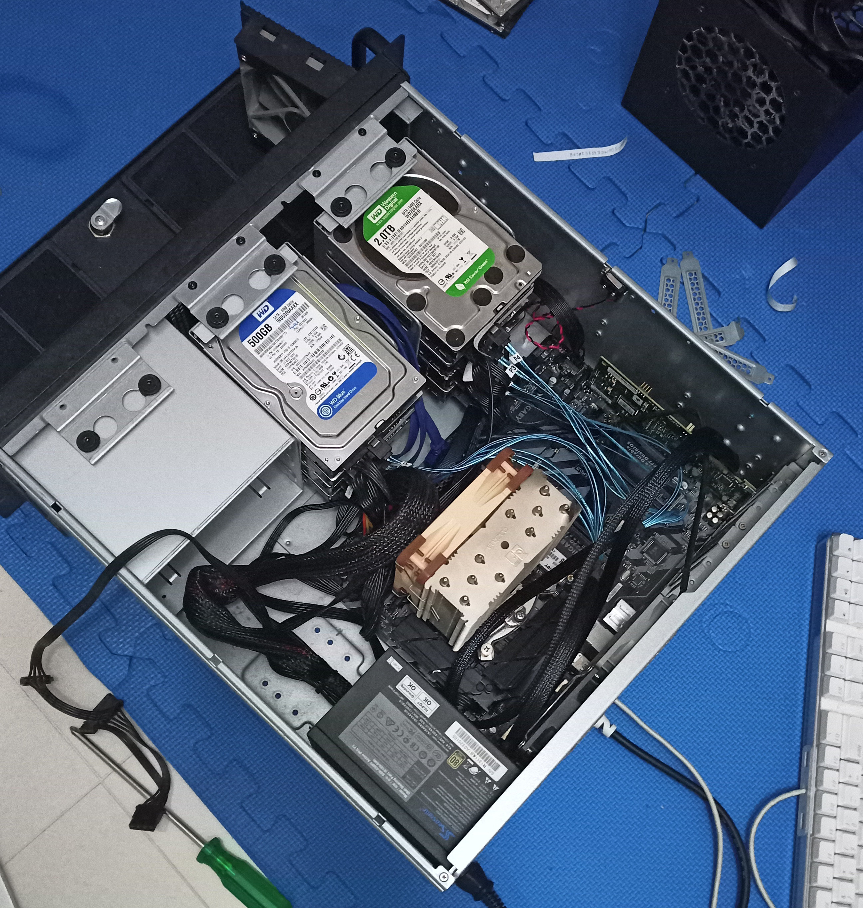
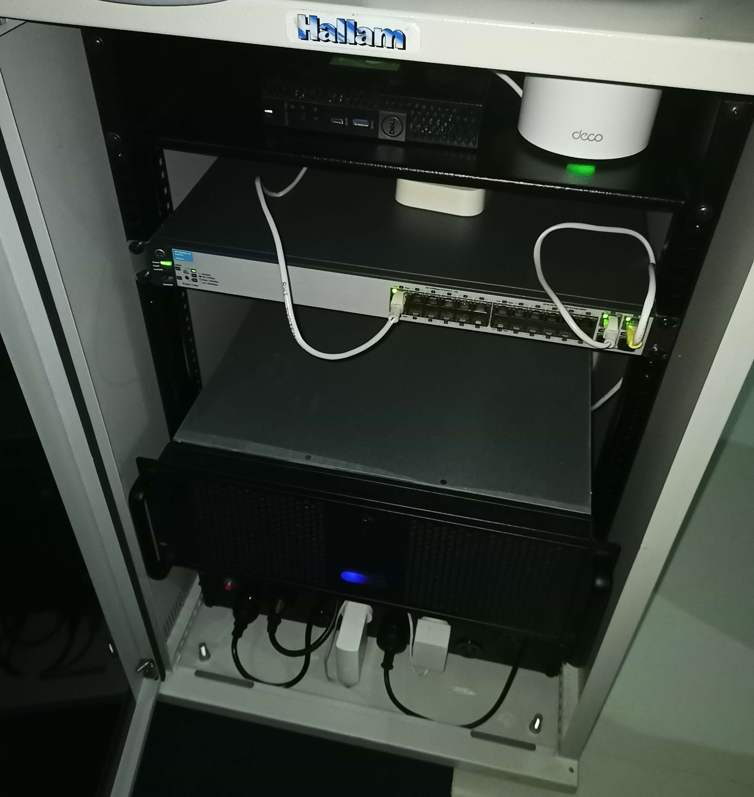
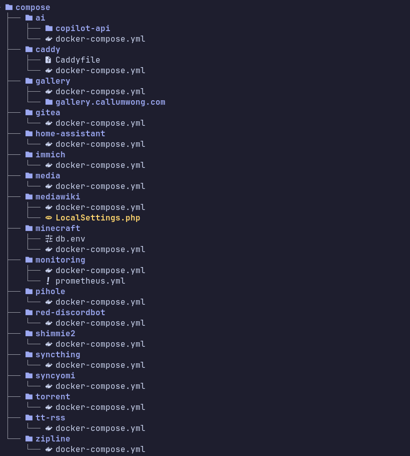
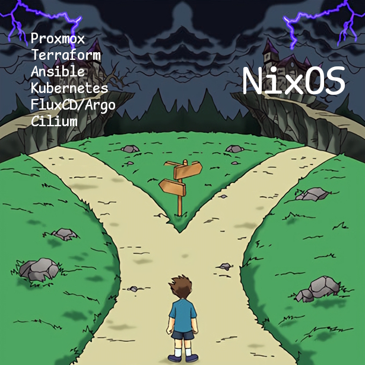
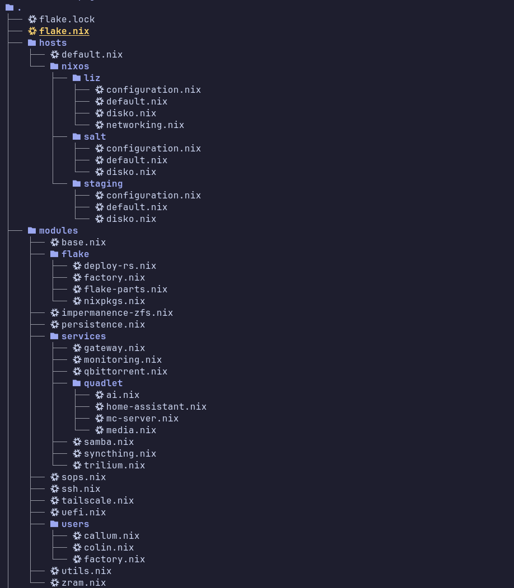
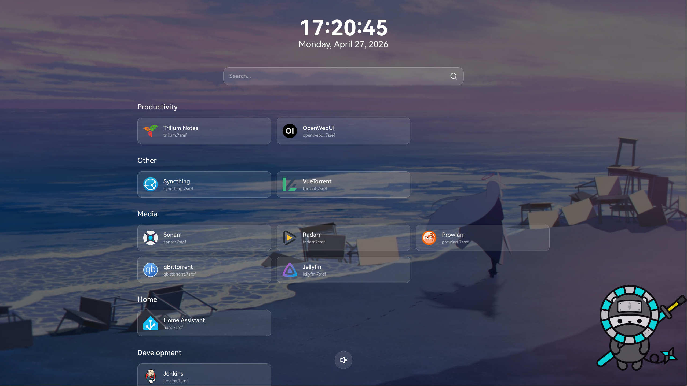

Last year, my school's sysadmin let me take anything from the hardware junkyard before it was all thrown out.
I've always wanted a cool server rack in my living room. Who wouldn't?
I took home a dingy server cabinet, which wasn't exactly my dream enclosure, but it was free!

So, I decided to move my homelab to the cabinet and also do some renovations on the software side of things.
I was reading good things about Infrastructure as Code and decided to give it a go.

> [!NOTE]
> You can find my NixOS configuration at https://github.com/L9-bms/nixos.

## Hardware

I didn't really have any problems with my Cooler Master Elite 110 case and [3D Printed hard drive enclosure](/posts/sas-expanders),
but it was admittedly pretty unsightly, especially with the power supply for the hard drives visible in plain sight.
I had to make use of the cabinet somehow though, so I dismantled the setup.

I found a SilverStone RM400 case on Facebook Marketplace for AU$10, which seemed to fulfill my needs pretty well.
I gave it a good clean and then migrated the internals inside.



The server cabinet was pretty disgusting, as expected of something sitting in storage for years.
Inside of it was an old HP switch, a power board and some AV equipment that I had no use for.
I took everything out, hosed it and wiped it down.

The switch is actually a HP E2620-24, an ancient piece of technology with only 2x gigabit ports and 24x 100 megabit ports.
I left it in the rack and connected it to a few IoT hubs and the security camera system which I moved inside.
Currently I'm not doing anything fancy network-wise.

The disk temperatures actually rose by about 5 degrees when housed in the new case.
This was to be expected though as they weren't receiving as much airflow as they were in my open enclosure.

Things are nicer to maintain in a larger case, and I also have headroom to add more things in the cabinet
if I ever come across more cheap server equipment.



## Software

### Architecture

My old setup was a simple Debian and Docker Compose stack. I stored compose files in a Git repo,
and a living document of changes I made to system configuration so that if everything burned down I could
get back up and running decently fast.
But it wasn't perfect, since there would always be some configuration that I forgot about.
Between reinstalls, I felt like I was running into issues that I had already solved before, but forgotten how to fix.
Another thing I hated was the feeling of having a generally *unclean* state on the system, built up from months of operation.



Infrastructure as Code (IaC) proved to be the solution to all of this.

To my knowledge, there are two main paths you can take on the trail of IaC, which are **Terraform+Ansible** and **NixOS**.

I had already been experimenting with NixOS on my daily driving laptop, and I had a pretty good experience with it.
Both paths seemed to be well trodden on by the homelab community, but I settled on NixOS after watching a few videos
on using it as a homelab OS on [Wolfgang's Channel](https://www.youtube.com/c/WolfgangsChannel).



### Configuration

The first version of my configuration was simply the standard `configuration.nix` and `hardware-configuration.nix`
and a bunch of modules that I imported for networking, services, etc.

When I converted more of my servers to NixOS (i.e. my game server machine), I decided to migrate to the
[Dendritic pattern](https://github.com/mightyiam/dendritic) for better modularity and the organisational flexibility of
`flake-parts` and `import-tree`. A helpful reference for this system is
[Doc-Steve's "Dendritic Aspect" Design Patterns](https://github.com/Doc-Steve/dendritic-design-with-flake-parts/wiki/Dendritic_Aspects).

I based the structure of my configuration on [Harrison Centner's nixconfig](https://github.com/HarrisonCentner/nixconfig) 
which was a nice starting point for me. 



### Impermanence

I then decided to make my system erase itself every time it rebooted. I followed
[Wolfgang's guide on an ephemeral ZFS root dataset](https://notthebe.ee/blog/nixos-ephemeral-zfs-root/)
which involved writing a [disko](https://github.com/nix-community/disko) configuration,
managing filesystem partitioning within the configuration, and writing a systemd service to roll back the dataset on startup.
This, combined with the [impermanence](https://github.com/nix-community/impermanence) module, completely solves the
earlier mentioned problem of a stale state, instead starting starting fresh on every reboot and explicitly choosing
what to persist in between.

### Secrets

I used [sops-nix](https://github.com/mic92/sops-nix) to manage my secrets, like user passwords and CA certificates.

A lot of people just keep their secrets files in their public configuration repo, which is usually fine because they are encrypted.
But this doesn't sit well with me, so I followed
[Unmoved Centre's article on secret management](https://unmovedcentre.com/posts/secrets-management/)
to store my secrets in a separate private Git repository.

### Services

I still had to consider what I would use to run my services.
I didn't like the idea of running them bare metal, so I stuck with containers.
Many love to use Kubernetes and GitOps, but as tempted as I was to try them out I only have 16 GB of RAM
and I want to waste as little of that as possible. Docker Compose is still a viable option on NixOS,
but I didn't want to have to manage a container stack separate from the system configuration.

I initially migrated my compose files using [compose2nix](https://github.com/aksiksi/compose2nix),
which produced NixOS `virtualisation.oci-containers` definitions and podman networks in the form of systemd services.
This actually worked fine for me, since I didn't really require any complex networking for my services.

But then I found [KeyRuu's post on quadlet-nix](https://keyruu.de/blog/quadlet/) which got me hooked with its
nicer syntax and automatic network management. I've been using quadlet-nix ever since and the only problems I had were
related to container healthchecks, but this seems to be an issue with Podman's systemd units rather than quadlet-nix.

### Dashboard

While I was still migrating my Docker Compose stacks to my new configuration, I saw
[SaltyAom's personal startpage](https://github.com/saltyaom/clear-morning).
I thought it looked really nice, so I decided to use Astro to build a similar looking dashboard with all of my homelab's services
called [Prism Tower](https://github.com/L9-bms/prism-tower).
The code generates service entries during build time based on `public/services.json`,
which is actually generated by Nix based on the flake input:

```nix
{
  outputs.lib.mkPrismTower.preBuild = ''
    echo '${builtins.toJSON services}' > public/services.json
  '';
}
```

```typescript
let services: Service[] = (await import("../../public/services.json")).default;
```

This way, I can automatically add services to the dashboard based on my NixOS config.
I defined Nix options for my service entries:

```nix
{
  options.modules.gateway = {
    localServices = lib.mkOption {
      type = lib.types.listOf (
        lib.types.submodule {
          options = {
            name = lib.mkOption {
              type = lib.types.str;
            };
            domainName = lib.mkOption {
              type = lib.types.str;
            };
            addr = lib.mkOption {
              type = lib.types.str;
            };
            iconUrl = lib.mkOption {
              type = lib.types.str;
              default = "";
            };
            category = lib.mkOption {
              type = lib.types.str;
              default = "Other";
            };
            hidden = lib.mkOption {
              type = lib.types.bool;
              default = false;
            };
          };
        }
      );
      default = [ ];
    };
  };
}
```

Defined them in my service module files: 

```nix
{
  modules.gateway.localServices = [{
    name = "Technitium DNS";
    host = "technitium.7sref";
    iconUrl = "https://cdn.jsdelivr.net/gh/homarr-labs/dashboard-icons/png/technitium.png";
    addr = "127.0.0.1:5380";
    category = "Administration";
  }];
}
```

And consumed them in my dashboard config:

```nix
{
  services.prism-tower = {
    enable = true;
    services = map (service: {
      name = service.name;
      url = "https://${service.host}";
      iconUrl = service.iconUrl;
      category = service.category;
    }) (builtins.filter (service: !service.hidden) config.modules.gateway.localServices);
  };
}
```

I can also programatically fetch the services from the JSON file if I decide to build a native dashboard app for my phone or something.



> [!TIP]
> I had some trouble setting a custom start page on Firefox. This is due to their security hardening or whatever.
> To bypass it, I followed the [instructions in n6v26r's dotfiles](https://github.com/n6v26r/.dotfiles/blob/main/firefox.md).

### DNS, Internal CA and Reverse Proxy

One thing I've always wanted is to be able to access my services with nice URLs instead of remembering port numbers.
I knew one way of doing this was running Tailscale on the service containers themselves and then letting MagicDNS do its thing,
but that didn't feel right to me.

I already liked using Caddy as a reverse proxy because of its automatic HTTPS conversion,
and I discovered that Caddy could actually generate certificates based on a custom root CA certificate.
[m0x2A's post](https://m0x2a.dreamymatrix.com/caddy-as-internal-ca-and-reverse-proxy/) and
[wait_what_'s post](https://waitwhat.sh/blog/custom_ca_caddy/) are very useful resources on this subject.
I also had to host a DNS server so that the actual URLs would be handled by Caddy.

I generated the certificates with Easy-RSA:

```bash
nix shell nixpkgs#easyrsa
easyrsa init-pki
easyrsa build-ca nopass
```

Added them to the secrets file:

```bash
nix run nixpkgs#sops path/to/secrets.yaml
```

Defined them:

```nix
{
  sops.secrets."caddy/ca.pem" = {
    owner = "caddy";
    group = "caddy";
    mode = "0440";
  };
  
  sops.secrets."caddy/ca.key" = {
    owner = "caddy";
    group = "caddy";
    mode = "0400";
  };
}
```

Defined a new CA, set the root CA certificate and key to their respective sops-nix secrets:

```nix
let
  # It's important to persist the data directory so that Caddy can keep its generated certificates
  caddyDataDir = config.utils.dataDir "caddy";
in
{
  services.caddy.globalConfig = ''
  storage file_system ${caddyDataDir}
    pki {
      ca 7sref_ca {
        name 7sref_ca
        root {
          cert ${config.sops.secrets."caddy/ca.pem".path}
          key ${config.sops.secrets."caddy/ca.key".path}
        }
      }
    }
  ''
}
```

For each service, defined a reverse proxy virtual host and set our previously defined CA:

```nix
{
  services.caddy.virtualHosts = builtins.listToAttrs (
    map (service: {
      # I added HTTP as well so machines without CA certificates can still access services.
      # If you do you'll have to set `auto_https disable_redirects` in the globalConfig.
      name = "http://${service.host}, https://${service.host}";
      value = {
        extraConfig = ''
          tls {
            issuer internal {
              ca 7sref_ca
            }
          }
          reverse_proxy ${service.addr}
        '';
      };
    }) config.modules.gateway.localServices
  );
}
```

Enabled the Technitium DNS Server and added an A record to the homelab's Tailscale IP via the WebUI.

```nix
{
  services.technitium-dns-server.enable = true;
}
```

> [!TIP]
> If you set your machines' DNS with Tailscale, make sure you use Split DNS, or disable
> all other nameservers and enable forwarding mode on your DNS server.
> System DNS resolvers don't really respect the order of your nameservers,
> so your system might end up querying public DNS for your internal domains and resolve nothing.
>
> Read: https://tailscale.com/docs/reference/dns-in-tailscale#the-order-of-dns-resolvers

### Deployment

Deploying onto the homelab is made really easy with [deploy-rs](https://github.com/serokell/deploy-rs).
I just had to define a `deploy.nodes` output for each host:

```nix
{
  outputs.deploy.nodes = lib.mapAttrs (hostname: hostConfiguration: {
    inherit hostname;
    profiles.system = {
      user = "root";
      sshUser = "callum";
      path = inputs.deploy-rs.lib.x86_64-linux.activate.nixos hostConfiguration;
    };
  }) config.flake.nixosConfigurations;
}
```

And then run:

```bash
nix run github:serokell/deploy-rs -- .#{{host}}
```

Installing to new hosts is just as easy:

```bash
nix run github:nix-community/nixos-anywhere -- --flake .#{{host}} --target-host {{user@hostname}}
```

I'm working on a way to automatically generate an SSH host keypair and add it to the sops config before reboot.

## Thoughts

I actually think NixOS is much more suited for server environments than desktop computers, and that I'll end up
switching back to a more traditional system on my laptop eventually. I'll continue to use the Nix package manager
on all of my machines.

Migrating my configuration at first was really chaotic, but as I became more familiar with Nix as a language
it's been pretty painless. I feel a lot more peace knowing my homelab config is completely declarative and reproducible,
and I've become better at thinking functionally in programming.
