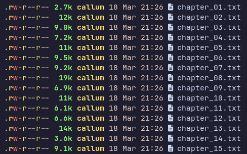
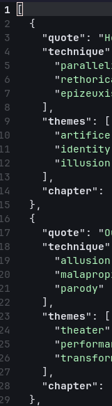
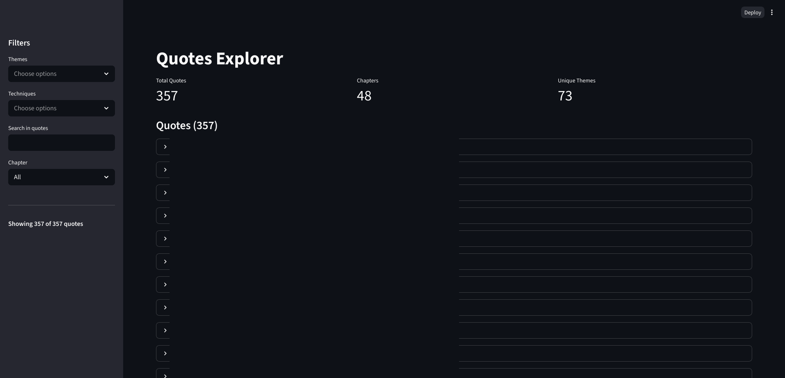

import { Image } from "astro:assets";
import Alert from "../../components/Alert.astro";

<Alert>
**Info:** No AI was involved in the writing of this post. No human intelligence was involved in the writing of the code.
</Alert>

## Why?

I hate English.

## How?

I extracted each chapter of my assigned text from the ePUB using a Python script that OpenCode wrote for me. I basically just asked it to separate each chapter into text files and fed it the beginning of the first chapter so it knows whether it succeeded or not.

Using OpenCode once again, I generated a script that prompts the local [Qwen3.5-35B-A3B-Uncensored](https://huggingface.co/huihui-ai/Huihui-Qwen3.5-35B-A3B-abliterated) model running on [koboldcpp](https://github.com/LostRuins/koboldcpp) using [smolagents](https://huggingface.co/docs/smolagents/index) to identify quotes from each chapter and assign to them their relevant themes and techniques. It then wrote a JSON and CSV file with this data.

Then, I prepared a list of literary techniques and one-word themes in the text. Nowadays AI is pretty good at not hallucinating things when you shove them right in front of it's face, so I just put them after my prompt with no issues.

I used OpenCode to generate a [streamlit](https://github.com/streamlit/streamlit) web UI which allows me to filter quotes by theme, technique, chapter and content.

## Results

It worked great. There were no hallucinations. LLMs often struggle greatly with finding quotes lesser known texts because the training data just doesn't really exist in large volumes, but this approach solved that problem.

So here I am. Now that I have my quotes, am I going to finally ace my English course?

No.
