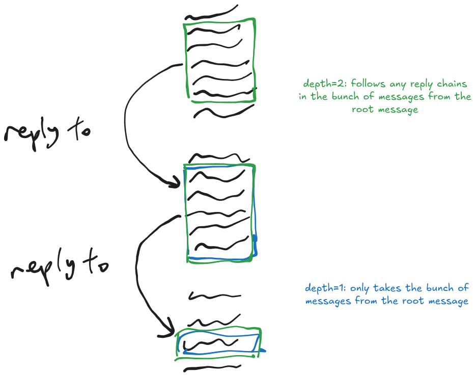

**Want to see the code?** https://github.com/L9-bms/discord-llm-scraper

## Why?

Often I will try to contribute to an open source project by first reading the docs, and then the source, and then joining the discord to understand why the code is written the way it is, and finally writing my PR.

I find the most time-consuming part is searching through the discord and traversing though reply chains, threads and conversations to gain knowledge that never made it into the docs ("tribal knowledge") and discover previous attempts on implementing the feature.

## See it in action!

## How it works

I was planning to use something like [DiscordChatExporter](https://github.com/nulldg/DiscordChatExporterPlus) to extract an entire Discord channel and then search through the chat for relevant conversations. But Discord [already has good search infrastructure](https://discord.com/blog/how-discord-indexes-trillions-of-messages), so I decided to use that instead. The HTTPS/REST search endpoints are documented on [Discord Userdoccers](https://docs.discord.food), many thanks to them.

The message returned by Discord might contain a message reference if it is a reply to another message, and I can also search a channel for messages around a message. Therefore, I designed the program to "traverse the chain" of replies, creating a tree of bunches of messages with a "root" which I can squash into a single conversation.

Then, these conversations are summarised with LLM, and embeddings are computed for them so they can be retrieved by similarity. Optionally they can be merged by similarity matrix. Then, the user can "query the conversation" by retrieving the "top-k" relevant chunks and feeding them and the question into an LLM. The embedded summaries are saved so that the user can query the set over and over.

"auto" mode works by generating initial search keywords from the query using LLM, then going through the whole process automatically. I might have to provide it with some context before finding keywords, though. It isn't very good at it yet.

TLDR; the program summarises Discord conversations with LLM, then uses RAG to answer the user's prompt.

I also implemented recursive reply chain traversal. For example, if I had a depth of 2, I would also traverse the replies of the bunch of messages around the first referenced message.

(sorry for the shitty explanation lol)

## Does it actually work?

**Not really...** there usually isn't enough context about what the conversations are actually talking about.

To make it actually useful, I'd have to integrate project documentation and code.

It was a cool project, though.
