import { Image } from "astro:assets";
import Alert from "../../components/Alert.astro";
import tierInstaller from "./tier-installer.png";
import energyCubeConfig from "./energy-cube-config.png";

## About

This is a guide for [Mekanism](https://github.com/mekanism/Mekanism), a Minecraft mod founded by [aidancbrady](https://github.com/aidancbrady) and actively developed by [pupnewfster](https://github.com/pupnewfster).
Mekanism is a fun and independent tech mod with linear progression, adding features such as:

- 5x ore processing,
- Jetpacks,
- Pet robots,
- Automatic mining,
- Nuclear reactors,
- and more!

You can download Mekanism on [Modrinth](https://modrinth.com/mod/mekanism) or [CurseForge](https://www.curseforge.com/minecraft/mc-mods/mekanism).

This guide assumes [Mekanism: Generators](https://modrinth.com/mod/mekanism-generators) is installed alongside the main mod.

## Getting Started

The first step is to gather some ores. You'll need plenty of iron and osmium and some copper to get started.

### Your First Generator

After you smelt the ores into ingots, craft a heat generator. The heat generator is the only Mekanism generator which doesn't require steel to craft.

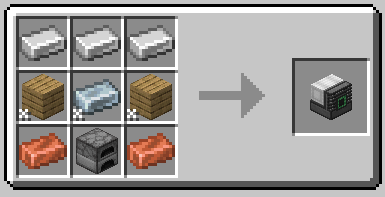

The heat generator generates energy in two ways:

#### Active Mode

In active generation mode, burnable fuel such as coal or charcoal is inserted into the generator. Different fuels provide different amounts of lava, but the lava is always converted to energy at the same speed. You can also insert lava buckets in the generator. The bucket will not be consumed.

#### Passive Mode

In passive generation mode, the heat generator is placed next to lava. The heat generator has 5 sides excluding the output side with a green square, but you can also lavalog the output cable and the generator itself. This means that you can passively generate energy with 7 "sides" of lava. The energy output is also affected by the biome temperature.

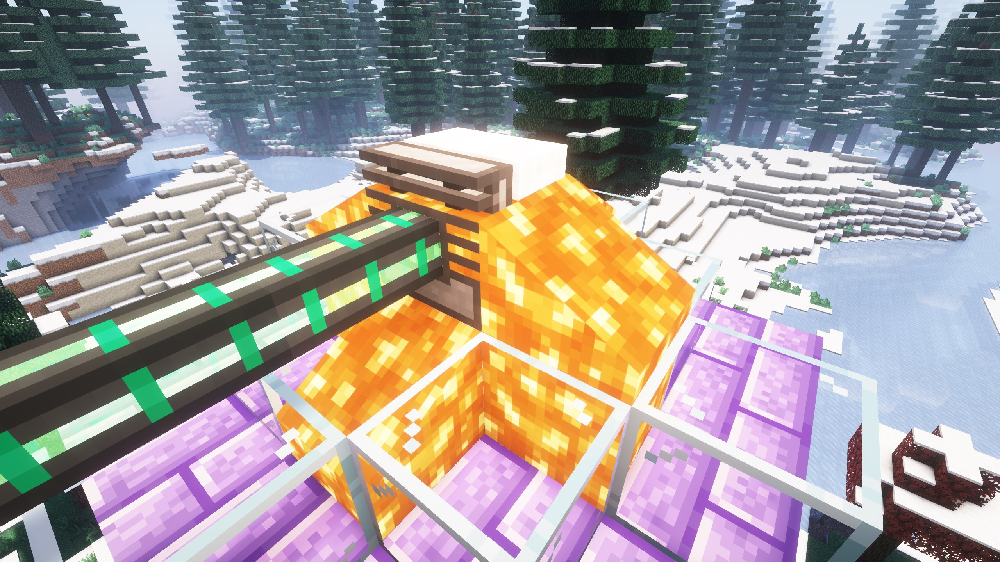

Since this is your first Mekanism generator, the heat generator outputs a very small amount of power.

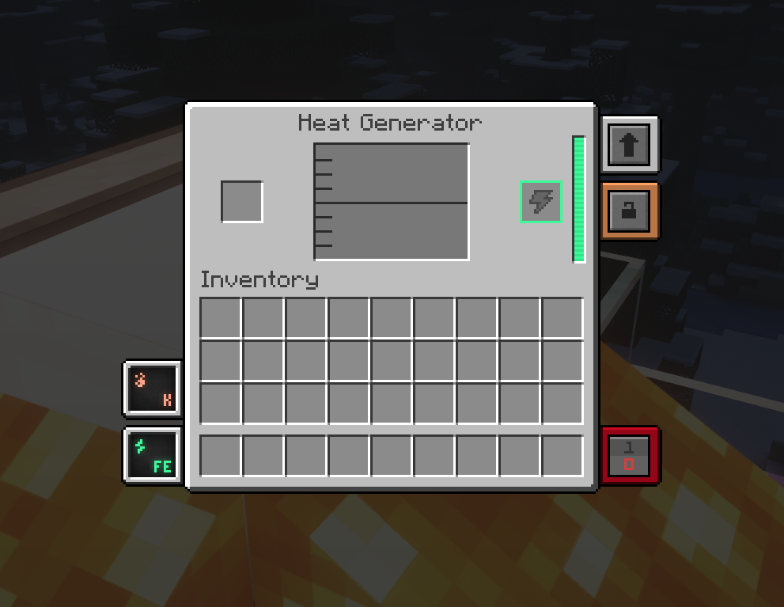

<Alert>
**Tip:** Use [JEI](https://www.curseforge.com/minecraft/mc-mods/jei) (or alternatives) to explore recipes. By default, hovering over an item and pressing [R] will show you the crafting recipes for that item. Hovering and pressing [U] will show you which recipes that item is used in. You can also use the list on the right side of any screen and left/right click to perform these actions. You can even use the [+] button while browsing recipes to move the requried items to your crafting grid, if you have them.
</Alert>

### Steel Production

Now that you have a source of power, you should produce some steel, a material used in basically every Mekanism recipe you'll use from now on. Craft a metallurgic infuser and connect it to your heat generator through the output side with a green square. 

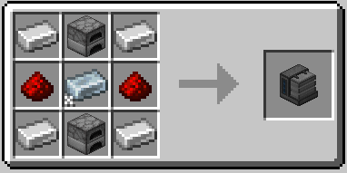

Insert some coal or charcoal in the slot above the "dump" button. If you want to minimize carbon wastage, insert 8 pieces of (char)coal. Insert iron ingots on the input slot and enriched iron will be outputted on the right. If you want to minimize wastage, insert 4 pieces. After this, put the enriched iron back in the input slot. You will get some steel dust. Smelt these, and you've got yourself some steel ingots!

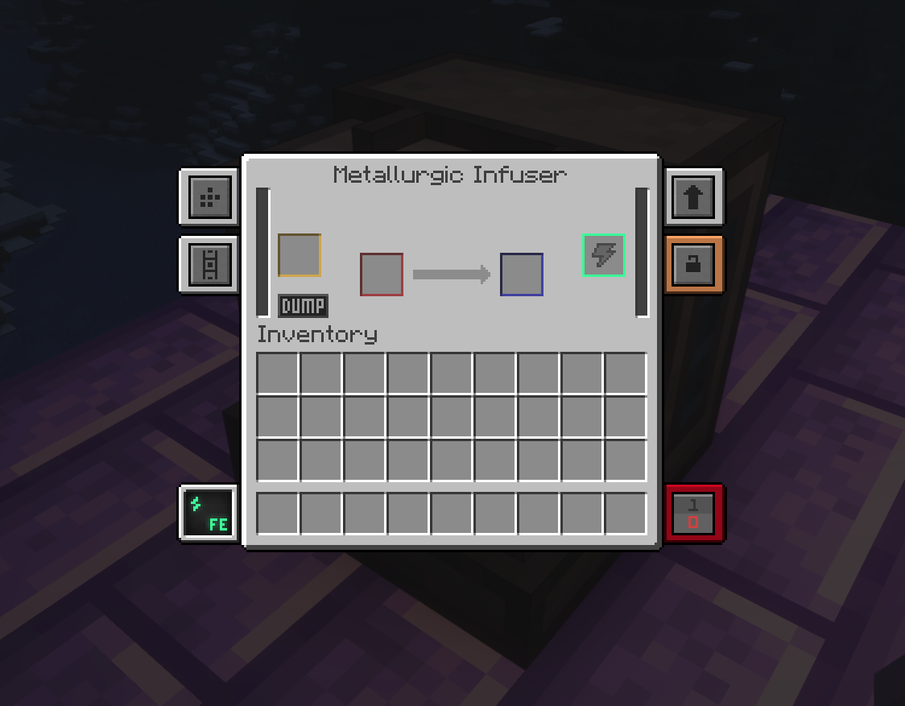

### Enrichment Chamber

For the enrichment chamber, you'll also need 2 basic control circuits. One basic control circuit can be produced by infusing an osmium ingot with 2 redstone dust. Now that you have the materials, craft a steel casing and then an enrichment chamber. Break the metallurgic infuser (be careful not to burn it if you're using passive heat generation mode) and place it down connected to your heat generator.

This is your first step in ore processing, obtaining better yield from raw ore. Some ores such as diamond and redstone can be processed straight away, but some such as iron and osmium will turn into 2 dusts which can be smelted into ingots. In Minecraft versions above 1.17, 3 raw ores will turn into 4 dust.

The enrichment chamber can used to make enriched carbon/redstone for use in the metallurgic infuser, which is 8x more efficient than using plain (char)coal or redstone dust.

<Alert>
**Info:** You should use the enriched version of materials in the metallurgic infuser whenever possible. This is especially important in later progression, where elite alloys and circuits will be infused with diamonds and obsidian.
</Alert>

### Cables

You'll probably want to transport your energy around. For this, you can craft universal cables. The first tier can only hold and transfer a limited amount of energy at a time, however upgrading is very easy. Simply right click with the corresponding alloy, and they will upgrade in place.

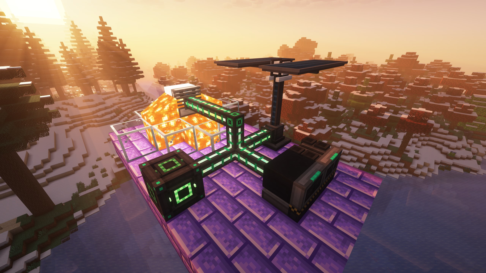

## Power Generation

You probably don't want to use the slow and inefficient heat generator for much longer, so here are some options for generating energy.

### (Advanced) Solar Generator

The solar generator is a single block that produces energy at daytime, with the energy output on the bottom of the block. Energy is generated at a slower rate when raining, and during night time and thunderstorms, the solar generator is inactive. The solar generator needs to be in direct sunlight, however transparent blocks will not reduce performance. The generator also generates more energy when placed higher in the world. The solar generator works better in colder biomes, unlike the heat generator. <ins>I **don't** recomend using the basic solar generator</ins> as it produces less energy than a heat generator in passive generation mode.

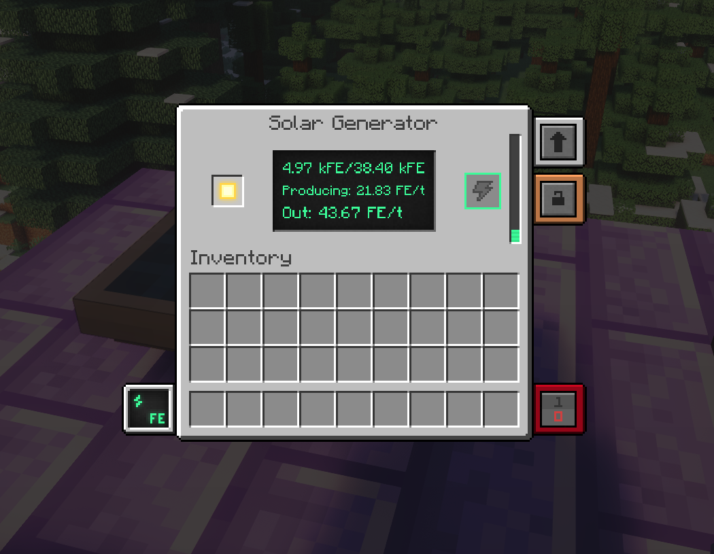

The advanced solar generator is a 3x3x3 machine and is crafted using 4 solar generators, but produces 6x more energy than a single solar generator. In order to operate, at least 5 blocks of the generator need to be in direct sunlight. For maximum performance, all 9 blocks above the generator should be in direct sunlight.

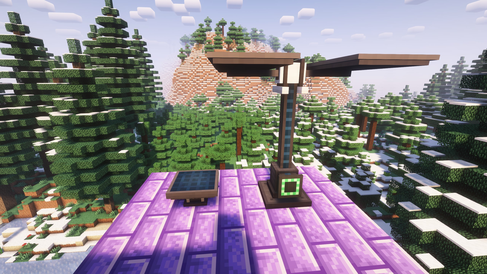

If you choose to rely on either of these generators, you will need to store energy in energy cubes to prevent blackouts at night and during bad weather.

### Wind Generator

The wind generator provides a consistent amount of energy depending on how high it is placed in the world. The generator cannot be blocked by solid blocks above it, but transparent blocks such as another wind generator are okay, so you can stack them if you really want to. Wind generators can be placed next to each other without issues.

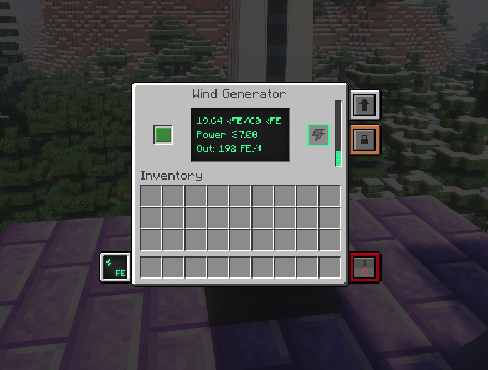

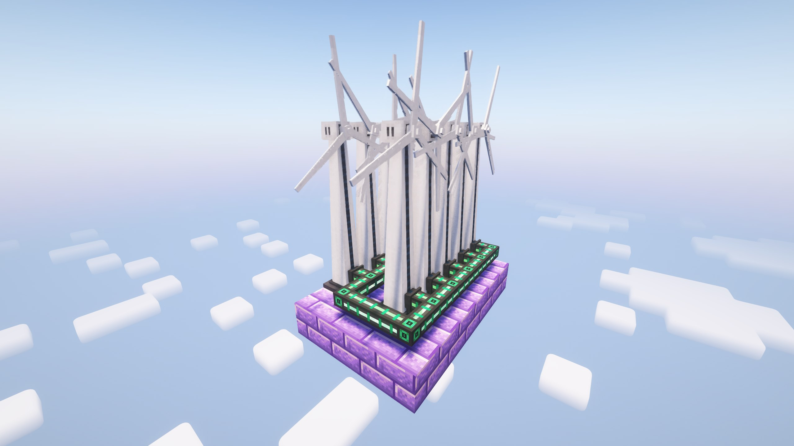

## Storing Power

Now that you are generating a decent amount of energy, you should craft a basic energy cube, which you can charge any items with, and can serve as a backup battery in the case of a blackout.

<Alert>
**Tip:** Configure your energy cube to input and output energy on all sides.

<Image src={energyCubeConfig} alt="Energy cube configuration" />
</Alert>

Once you start to generate massive amounts of energy, you can replace your energy cubes with an induction matrix. These multiblock structures consist of casings, induction ports to transfer power in and out of the matrix, induction cells to store power, and induction providers to increase the power transfer rate.

## Basic Machines

All machines in Mekanism are based on infused alloy, which is made by infusing iron ingots with redstone in a metallurgic infuser, and steel casings. After crafting these, you can create machines such as the energized smelter, crusher, and more.

<Alert>
**Tip:** Most of Mekanism's blocks will store their contents, upgrades, and energy when broken.
</Alert>

### Side Configuration

The side configuration button in the top left corner of a machine GUI will open the following interface:

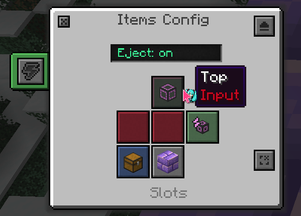

This screen is used to program which sides the machine should input/output items, energy, fluids, and gas. It can also ignore sides to prevent unwanted transfer. 

## Upgrading to Factories and Beyond

Most Mekanism machines can be turned into a factory, allowing multiple items to be processed at the same time. These factories can be upgraded from Basic to Ultimate tier.

 smelting factory")

<Alert>
**Tip:** If you don't want to break your machines every time you upgrade them, use tier installers.

<Image src={tierInstaller} alt="Elite Tier Installer Recipe" />
</Alert>

Upgrades can also be used on machines to improve them. Speed upgrades energy upgrades make them faster and more energy efficient, respectively. For both of these, 8 can be installed in each machine. Make sure that your setup has enough energy to power your upgraded machines, as the power usage for each operation increases with the number of speed upgrades.

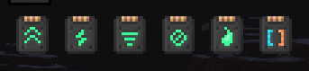

## Next Steps

After completing this guide, you should have a solid starting point for your Mekanism world. You can use Mekanism's machines in any way you can think of. Want infinite glass? Just generate some cobblestone, crush it, crush it again, and then smelt it. Here are some goals you may want to work towards:

- Upgrade your ore processing setup
- Upgrade your power generation with an [ethylene powered gas-burning generator](/posts/ethylene-gas)
- Craft free runners and/or a jetpack, powered by the hydrogen produced by your ore processing setup
- Craft a digital miner, an extremely powerful machine to extract materials from the world
- Use quantum entangloporters to transmit energy, items, fluid, and gas across large distances or dimensions
- Build a nuclear fission reactor to harness polonium, while also generating lots of power
- If you haven't already set up a storage system, consider Mekanism's QIO
- Craft a MekaTool, an all-in-one modular tool and weapon, and a MekaSuit, a modular armour set with a super-cool HUD, absorbing all damage at the expense of energy (except for armour bypassing damage, like Create's crushng wheels)
- Craft a supercritical phase shifter to create antimatter, the final Mekanism material
- Turn coal into diamonds, and enchant your golden apples with an antiprotonic nucleosynthesizer

Have fun!
