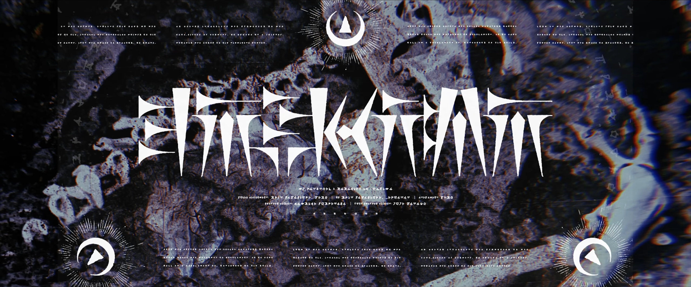
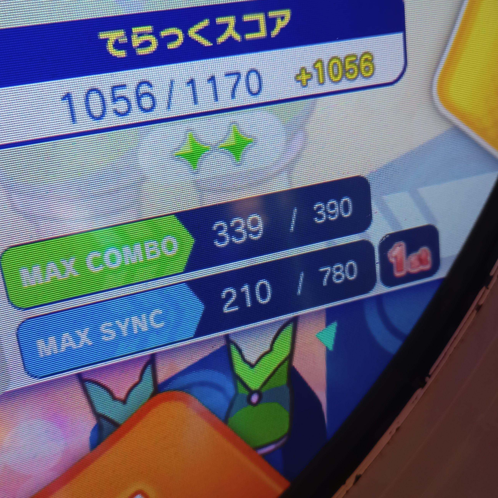

import { Image } from "astro:assets";
import { Tweet, YouTube } from "astro-embed";
import Alert from "../../components/Alert.astro";
import bad from "./bad.jpg";
import moonbase from "./moonbase.jpg";
import spaceTravelTicket from "./space-travel-ticket.jpg";

## TJ.hangneil Area

1. Complete the sasakure.UK Area (240km).
2. Clear the **神威** (Kamui) Perfect Challenge at 400km.
3. Complete the TJ.hangneil Area (444km). You will receive the *旅行スタンプ（月面基地）*(Travel Stamp (Moonbase)) icon.

<Alert>
During the Japanese version of the event, the icon unlock process was different:

Prior to the event, the project raputa official Twitter account posted [this video](https://twitter.com/project_raputa/status/1730145512400326679), which features lines extending from the letters "sasakure.UK × TJ.hangneil" moving up and to the left. Taking the strings "sasakureuk" and "tjhangneil" on a standard QWERTY keyboard, and moving upward and leftward until reaching the number line, produces the numbers 2121874378 and 5761656389 respectively. Multiplying them together produces the number 12225511066659101042. If this number is entered as a serial code on maimai-net, the player receives the icon 旅行スタンプ(月面基地) (Travel Stamp - Moon Base).

Source: [project raputa - RemyWiki](https://silentblue.remywiki.com/project_raputa)
</Alert>

<Tweet id="https://x.com/project_raputa/status/1733352843267178868" />

4. Play the Standard Master or DX Expert/Master difficulty of **39** and have a maximum combo of exactly 339. You will receive the *宇宙旅行券* (Space Travel Ticket) nameplate.

<Alert>
**Tip:** In the options before starting the track, change the DISPLAY AT CENTER setting to COMBO.
</Alert>

5. Equip both the *旅行スタンプ（月面基地）* icon and *宇宙旅行券* nameplate to unlock the 月面ちほー (Lunar Surface Area).

    <Image src={moonbase} alt="旅行スタンプ（月面基地）" />
    <Image src={spaceTravelTicket} alt="宇宙旅行券" />

## Lunar Surface Area

<Tweet id="https://x.com/project_raputa/status/1733397529247859159" />

<Alert>
**Info:** It is optional to complete the 月面ちほー (Lunar Surface Area) (240km). But why wouldn't you?
</Alert>

1. In the 月面ちほー (Lunar Surface Area), unlock the song **月面基地** (Moonbase) at 100km, and unlock the Master difficulty (achieve an S or higher on Expert or Master). Alternatively, perform step 2 while playing with someone who has unlocked the song and its Master difficulty. 

<figure>
 <video src="/video/break-the-moon-base-with-beam.mp4" preload="metadata" controls></video>
 <figcaption>By placing each five-character title in the order they are received from the area and reading along the yellow line in the nameplate, a message will be revealed: **BREAK THE MOON BASE WTH B.E.A.M.**</figcaption>
</figure>

2. Play the unlocked song **月面基地** 4 times in a single play in the following order: BASIC, EXPERT, ADVANCED, MASTER. <ins>Only hit the BREAK notes and miss everything else.</ins> You will receive the *旅行スタンプ（???）*(Travel Stamp (???)) icon.

<Alert>
**Tip:** To perform this alone, insert 2 credits as if you were playing with another person. This allows you to play all 4 difficulties in a single play.

- In the BASIC chart, there are 10 breaks.  
- In the EXPERT chart, there are 3, and they are all during double taps on the A3 sensor.  
- In the ADVANCED chart, they are the last 2 notes.  
- In the MASTER chart, there are 22.

Source: [maimai AUS](https://discord.com/channels/751359842354200647/1230461337067585596/1230461337067585596) ([invite](https://discord.gg/B5hKNrd))
</Alert>

3. Equip the *旅行スタンプ（???）* icon <ins>and the *宇宙旅行券* nameplate recieved earlier</ins> to unlock the 裏 月面ちほー (Far Side of the Moon Area).

")

<Alert status='warning'>
**Info:** If the area does not unlock on your next play, make sure you equip BOTH the icon and the nameplate. Don't do this:

<Image src={bad} alt="Icon equipped with different nameplate" />

or you might end up confused like I was.
</Alert>

## Far Side of the Moon Area

<Tweet id="https://x.com/project_raputa/status/1733418056108666941" />

1. Clear the Perfect Challenges **Apollo** at 200km and **raputa** at 654km.
2. Complete the 裏 月面ちほー (Far Side of the Moon Area) (666km) to obtain the *project raputa completed* title.

<Tweet id="https://x.com/project_raputa/status/1733457050955632702" />
