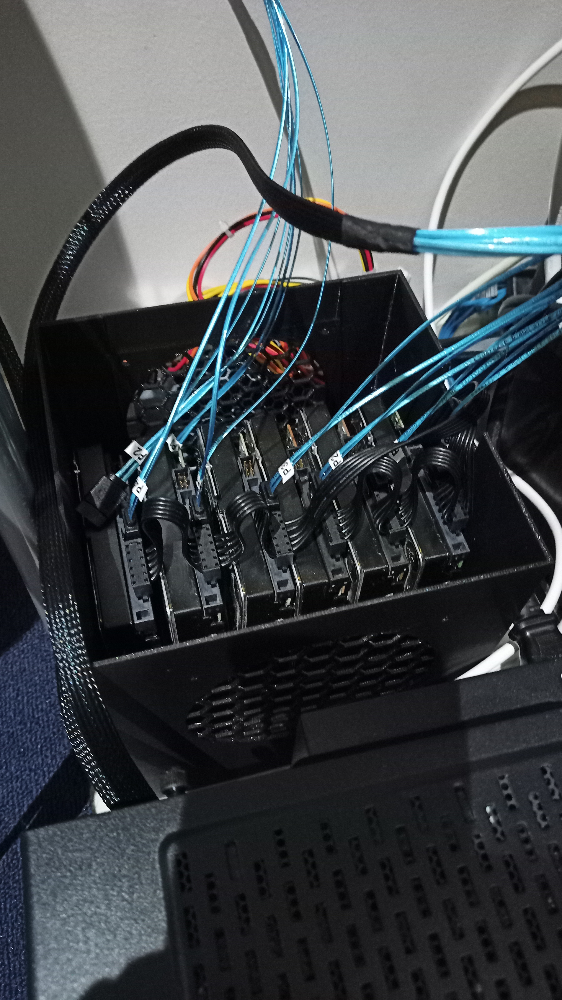
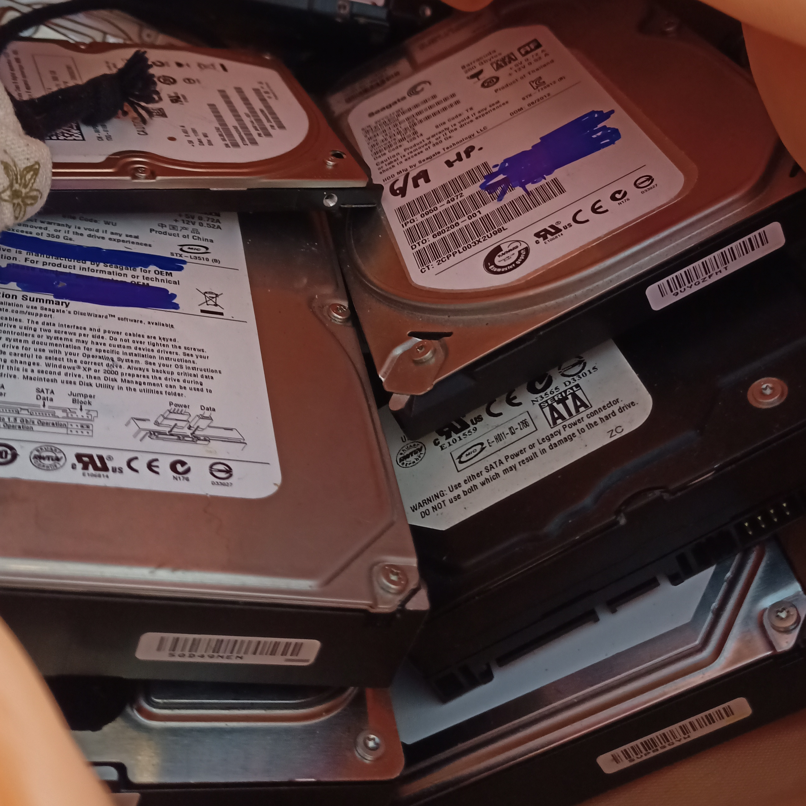
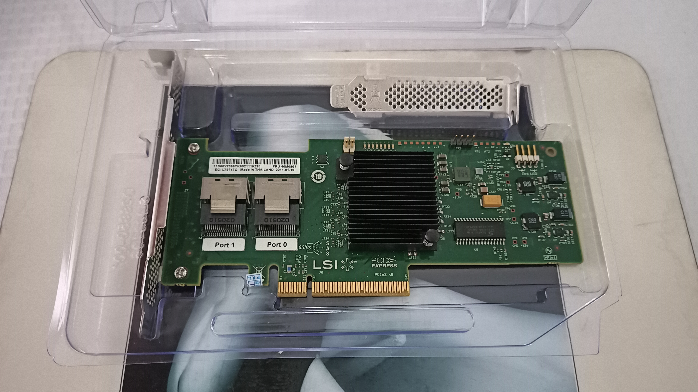
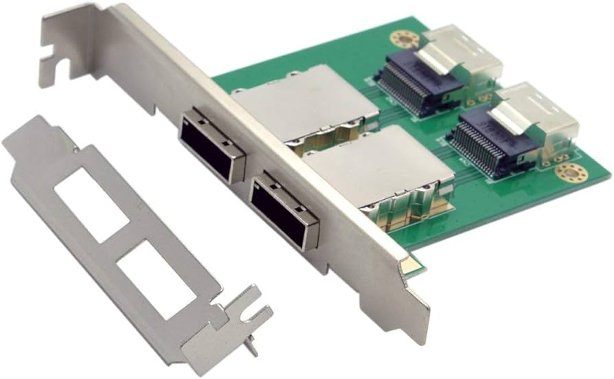
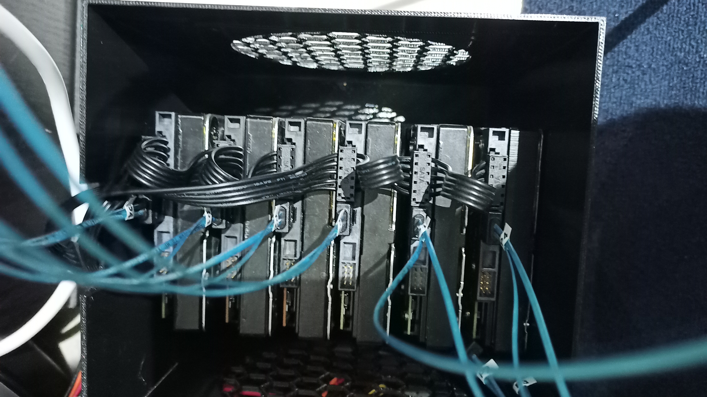
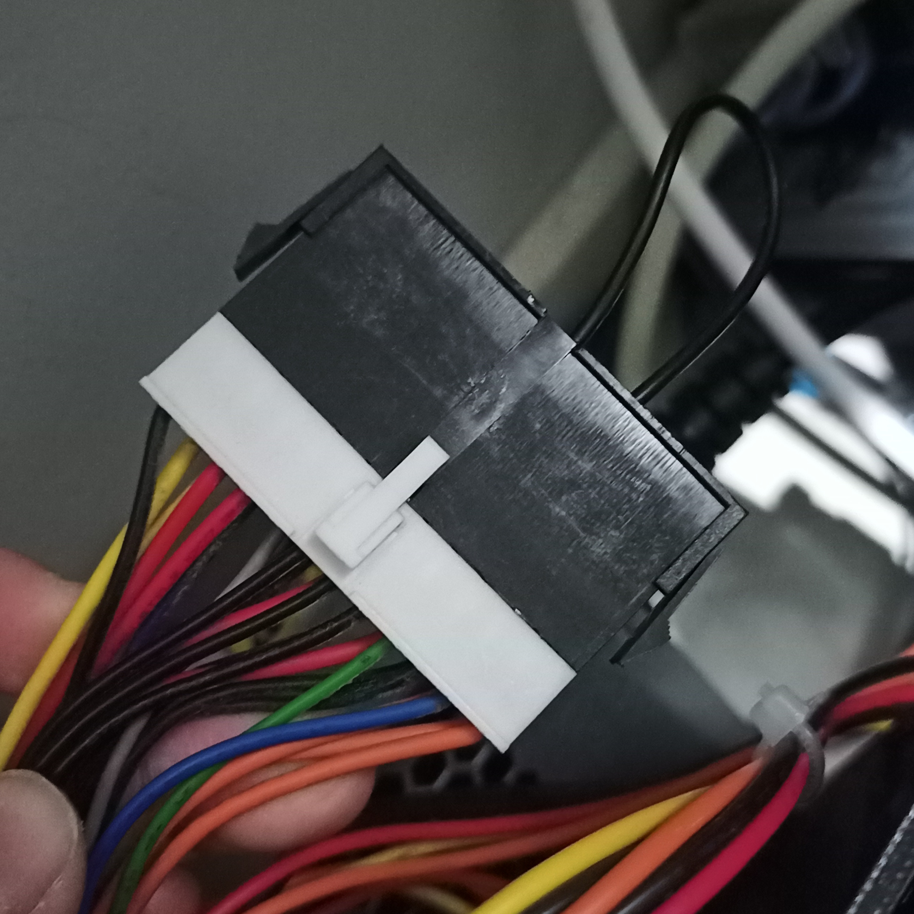
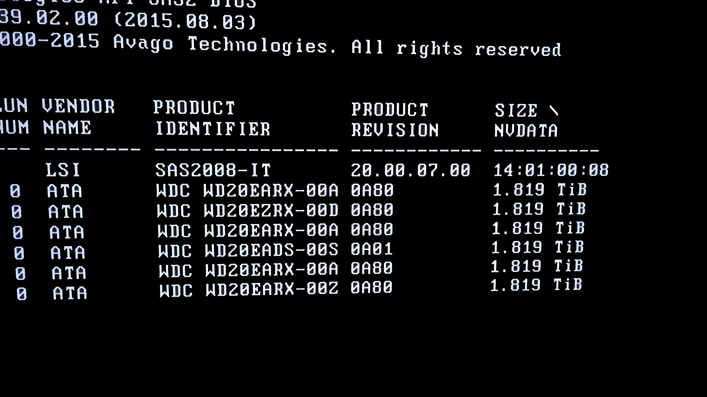

import { YouTube } from "astro-embed";

In this article, I walk through how I added 6TB to my homelab's storage using a SAS controller, an old power supply, a 3D printed enclosure and some cheap parts from AliExpress for less than **AU$200**.

## Introduction

My home server consisted of 4 500GB SATA HDDs. Two of them were spare 3.5" drives, and the other two were 2.5" drives pulled from old laptops. I used ZFS to mirror the drives in pairs and then stripe the mirrors, forming a RAID1+0 configuration. It wasn't long before I started filling up the single terabyte I had, especially with other family members using the same zpool.

My original plan was to purchase a pair of decently large hard drives which I could replace one of my mirrors with, but I was disappointed to realise that they costed hundreds of dollars each. This left me essentially keep hunting for good deals on drives until I would eventually cave and buy them because I needed the extra storage.

That was until I met a very nice person who offered me a whole lot of old SATA HDDs for AU$100. It included a mix of drives from 160GB to 1TB, including more 500GB 2.5" drives than I'd ever need, and more importantly, **11 2TB 3.5" drives**.

`smartctl` indicated one of the drives as completely faulty, and another was reporting errors. This left me with 9 usable 2TB drives.

## Components

At this point, I already knew it was possible to connect more hard drives to a server through a **HBA (host bus adapter)** in a PCIe slot. However, I only knew about SATA expanders, which was the cheapest and most logical solution I had.

While searching for these cards, it realised that I had to find somewhere to put these drives. My existing case could fit a maximum of 3 3.5" drives and another 2.5" drive. Buying a new case with enough capacity would be too expensive to justify, so I researched how I could DIY an external enclosure.

I found Sloth Tech TV's [6x 3.5" Hard drive enclosure](https://www.thingiverse.com/thing:4840108/comments), which is printable on a regular sized 3D printer like a Creality Ender 3. I was able to get this printed by a seller on Facebook Marketplace for AU$30, which is probably more expensive than buying a spool of filament and borrowing a printer at a makerspace, but oh well. The enclosure is stackable and can hold 2 120mm fans for extra airflow.

Sloth Tech TV's video on [Cheap HBA and SAS expander options](https://www.youtube.com/watch?v=hBnuW8DfLNM) helped me tremendously in discovering SAS HBAs and multi-lane internal mini-SAS connectors.

<YouTube id="https://www.youtube.com/watch?v=hBnuW8DfLNM" />

I chose to purchase a **LSI 92xx-8i card** which was pre-flashed to 9211-8i IT mode on eBay for AU$40. The listing included 2 SAS SFF-8087 breakout cables which each split their four lanes into SATA connections, which can be purchased on AliExpress for about AU$6 each.

I concluded from my research that SAS HBA cards typically feature SFF-8087 ports internally, and some cards also feature additional SFF-8088 ports. SFF-8088 cables are more durable and look very nice, but both SFF-8088 to SFF-8088 cables and SFF-8088 to SATA cables are considerably more expensive than SFF-8087 to SATA cables.

You could buy SFF-8088 cables **and** SFF-8087 cables, and attach an adapter to your enclosure (Sloth Tech TV also has a [3D-printable case](https://www.thingiverse.com/thing:4861870) for these). This gives you more flexibility in regards to how far away you can put your enclosure from your server.

By using this setup, I can connect 6 external 2TB drives, giving me an extra 6TB of storage in the same mirror + stripe configuration. I also have 3 leftover drives which I can use to replace failed drives.

### Power

To power the external drives, I decided to harvest a power supply from an old PC, which very simply included a 24-pin motherboard connector, a 4-pin CPU connector and 2 SATA connectors. I bought 2 1-to-3-connector splitters from AliExpress for AU$3 each to power my 3 drives.

I also bought a jumper bridge for the 24-pin motherboard connector for AU$1. This is necessary because the power supply will not turn on unless pins 4 and 5 are jumped. This could also be done with a paperclip or a short piece of wire.

Because these pins are always jumped, the external drives will always be on regardless of the main server. To fix this, you could use a dual PSU adapter to link their power states.

## Migrating Data

I was greeted by a nice BIOS screen listing my hard drives and their sizes, confirming that they were all recognised by the HBA and that the card was in IT mode.

I `zpool add`ed the drives in pairs, and then `zpool remove`d the old ones to free up 2 slots inside of the main case. Perhaps those slots will later be used for SATA SSDs.

## Conclusion & Alternatives

This project was great fun. It taught me a lot about SAS hardware which I would never know about if I chose to just buy 2 new SATA drives.

If you already have a 3D printer and want to hold 6 3.5" drives (which are hotswappable), 3 2.5" drives and the rest of your hardware inside a single 3D printable case, I'd highly recommend printing assembling makerunit's [3D Printed 6-Bay NAS case](https://www.youtube.com/watch?v=Ce4ZY1JmNKg). To say it's beautiful would be an understatement, and if I didn't already have a case I would definitely spend the time and effort to build this instead. Just look at the magnetic covers!!
